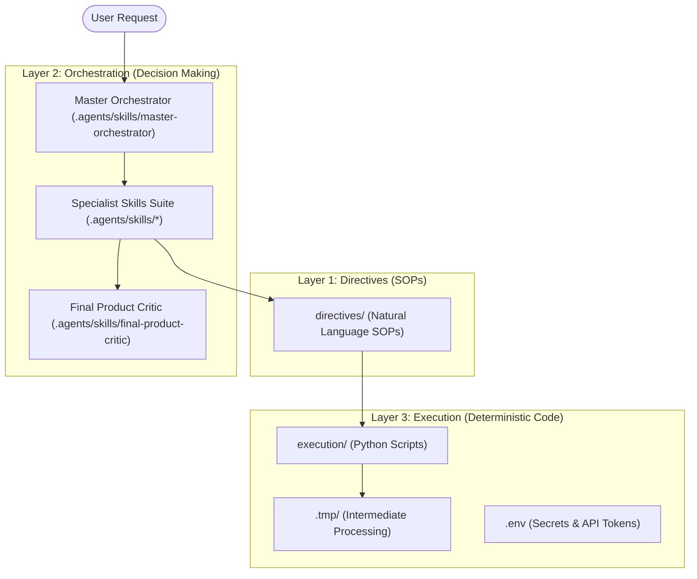
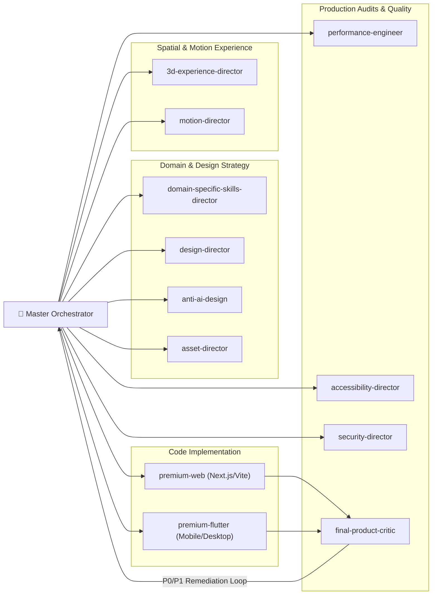

# Antigravity Master Suite

[](file:///d:/Antigrvity%20master/AGENTS.md)
[](file:///d:/Antigrvity%20master/.agents/skills/)
[](file:///d:/Antigrvity%20master/tests/MASTER_ORCHESTRATOR_FINAL_TEST.md)

**Antigravity Master** is an enterprise-grade, agentic product development workspace designed to bridge the gap between probabilistic LLM intent and deterministic engineering execution. Built on a strict **3-Layer System Architecture** (Directive → Orchestration → Execution), this repository hosts a suite of **13 production specialist skills** capable of orchestrating, designing, auditing, and implementing web apps, cross-platform Flutter applications, WebGL 3D experiences, and autonomous AI agent systems.

---

## 🏗️ 3-Layer Architecture Overview

To eliminate compounding LLM errors over multi-step product development, this repository separates concerns into three distinct layers:



| Layer | Responsibility | Directory Location | Primary Function |
| :--- | :--- | :--- | :--- |
| **Layer 1: Directive** | Standard Operating Procedures (SOPs) | [`directives/`](file:///d:/Antigrvity%20master/directives/README.md) | Natural-language markdown instructions defining goals, tools, and edge cases. |
| **Layer 2: Orchestration** | Intelligent Decision & Skill Routing | [`.agents/skills/`](file:///d:/Antigrvity%20master/.agents/skills/) | Evaluates intent, selects specialist skills, coordinates parallel tasks, and enforces quality gates. |
| **Layer 3: Execution** | Deterministic Python Operations | [`execution/`](file:///d:/Antigrvity%20master/execution/README.md) | High-reliability Python tools handling file I/O, network requests, data transformations, and API calls. |

---

## 🧠 Master Orchestrator & Specialist Skills Suite

The repository contains **13 specialized production skills** managed by the **Master Orchestrator**. Each skill folder contains an authoritative operational instruction file ([`SKILL.md`](file:///d:/Antigrvity%20master/.agents/skills/master-orchestrator/SKILL.md)), human-readable documentation ([`README.md`](file:///d:/Antigrvity%20master/.agents/skills/master-orchestrator/README.md)), and concrete reference strategy templates ([`references/`](file:///d:/Antigrvity%20master/.agents/skills/master-orchestrator/references/orchestration_matrix_template.md)).



### Specialist Skills Directory Matrix

| Skill Folder | Role / Category | Primary Focus & Capabilities | Reference Template |
| :--- | :--- | :--- | :--- |
| [`master-orchestrator`](file:///d:/Antigrvity%20master/.agents/skills/master-orchestrator/) | **Master Orchestrator** | Multi-skill coordination, category detection (Web/Flutter/AI), dependency graphs, 5 Quality Gates, critic fix loops. | [Orchestration Matrix](file:///d:/Antigrvity%20master/.agents/skills/master-orchestrator/references/orchestration_matrix_template.md) |
| [`domain-specific-skills-director`](file:///d:/Antigrvity%20master/.agents/skills/domain-specific-skills-director/) | **Domain Strategy** | Multi-domain classification (Fintech, Healthcare, SaaS, AI, DevTools), user roles, critical workflows, trust compliance. | [Domain Strategy](file:///d:/Antigrvity%20master/.agents/skills/domain-specific-skills-director/references/domain_strategy_template.md) |
| [`design-director`](file:///d:/Antigrvity%20master/.agents/skills/design-director/) | **Visual Art Director** | Bespoke product identity, ratio-based typography matrix, functional color tokens, spacing grid, 8-state component rules. | [Design Direction](file:///d:/Antigrvity%20master/.agents/skills/design-director/references/design_direction_template.md) |
| [`anti-ai-design`](file:///d:/Antigrvity%20master/.agents/skills/anti-ai-design/) | **Visual Critic & Anti-Cliché** | Cliché elimination (purple glowing orbs, glassmorphism overlays, repetitive cards), 1,000 Products Test, subtraction audit. | [Audit Plan](file:///d:/Antigrvity%20master/.agents/skills/anti-ai-design/references/audit_plan_template.md) |
| [`asset-director`](file:///d:/Antigrvity%20master/.agents/skills/asset-director/) | **Media Pipeline Architect** | Sourcing strategy, multi-format media pipelines (AVIF/WebP/WebM/KTX2), SVG symbol sprites, priority loading. | [Asset Strategy Plan](file:///d:/Antigrvity%20master/.agents/skills/asset-director/references/asset_plan_template.md) |
| [`3d-experience-director`](file:///d:/Antigrvity%20master/.agents/skills/3d-experience-director/) | **3D & Graphics Specialist** | Technology-agnostic 3D rendering (Three.js, R3F, WebGL/WebGPU, Flutter 3D), Draco/KTX2 mesh compression, 4-tier fallbacks. | [3D Experience Plan](file:///d:/Antigrvity%20master/.agents/skills/3d-experience-director/references/3d_experience_plan_template.md) |
| [`motion-director`](file:///d:/Antigrvity%20master/.agents/skills/motion-director/) | **Motion Architect** | 4-level motion hierarchy, 100-300ms duration tokens, spring physics curves, GPU-whitelisted CSS, `prefers-reduced-motion`. | [Motion Plan](file:///d:/Antigrvity%20master/.agents/skills/motion-director/references/motion_plan_template.md) |
| [`performance-engineer`](file:///d:/Antigrvity%20master/.agents/skills/performance-engineer/) | **Systems Performance Architect**| Core Web Vitals (LCP, INP, CLS), WebGL draw calls & VRAM caps, Flutter rebuild narrowing, Dart Isolates, memory leak checks. | [Performance Plan](file:///d:/Antigrvity%20master/.agents/skills/performance-engineer/references/performance_plan_template.md) |
| [`accessibility-director`](file:///d:/Antigrvity%20master/.agents/skills/accessibility-director/) | **WCAG 2.1 AA Compliance** | Screen-reader ARIA/Semantics trees, 200% font scale survival, 48x48px touch targets, visible focus traps, 3D text fallbacks. | [Accessibility Strategy](file:///d:/Antigrvity%20master/.agents/skills/accessibility-director/references/accessibility_strategy_template.md) |
| [`security-director`](file:///d:/Antigrvity%20master/.agents/skills/security-director/) | **Security Architect** | Security-by-Design, STRIDE threat model, server-side RBAC/ABAC, BOLA/IDOR protection, OWASP defenses, AI prompt injection & tool gates. | [Security Strategy](file:///d:/Antigrvity%20master/.agents/skills/security-director/references/security_strategy_template.md) |
| [`premium-web`](file:///d:/Antigrvity%20master/.agents/skills/premium-web/) | **Frontend Web Developer** | Creative web architecture (Next.js, Vite, React, Vue, Svelte, HTML/CSS/JS), fluid `clamp()` design tokens, 3-tier progressive enhancement. | [Implementation Plan](file:///d:/Antigrvity%20master/.agents/skills/premium-web/references/implementation_plan_template.md) |
| [`premium-flutter`](file:///d:/Antigrvity%20master/.agents/skills/premium-flutter/) | **Cross-Platform Flutter Architect**| Multi-platform Flutter apps (iOS, Android, Desktop, Web), adaptive vs responsive layouts, `CustomPainter`, Dart Isolates, 8-state widgets. | [Implementation Plan](file:///d:/Antigrvity%20master/.agents/skills/premium-flutter/references/implementation_plan_template.md) |
| [`final-product-critic`](file:///d:/Antigrvity%20master/.agents/skills/final-product-critic/) | **Quality Gatekeeper** | Independent empirical product audit, 13-point category review order, P0-P3 severity matrix, defensible `SHIP` / `BLOCKED` verdicts. | [Product Review](file:///d:/Antigrvity%20master/.agents/skills/final-product-critic/references/product_review_template.md) |

---

## ⚡ The 5 Quality Gates & Remediation Loop

Every multi-skill development workflow passes through 5 mandatory Quality Gates managed by `master-orchestrator`:

1. **Gate 1 (Requirement Gate)**: Product category (Web / Flutter / AI Assistant), primary domain, and core user journey defined.
2. **Gate 2 (Design Gate)**: Design system tokens, typography scales, and anti-AI cliché subtraction verified.
3. **Gate 3 (Implementation Gate)**: Clean code generated (`premium-web` / `premium-flutter`) with 8-state component coverage.
4. **Gate 4 (Production Audits Gate)**: Core Web Vitals, WCAG AA accessibility contrast, and server-side security authorization verified.
5. **Gate 5 (Final Product Critic & Fix Loop)**: Independent audit executed by `final-product-critic`. If P0 Blockers or P1 Critical issues are identified, findings are automatically routed back to responsible specialists for remediation before final release approval.

```text
       Gate 1           Gate 2             Gate 3              Gate 4                  Gate 5
┌─────────────────┐ ┌────────────┐ ┌────────────────────┐ ┌────────────────┐ ┌───────────────────────────┐
│ Requirements &  │─►  Design &  │─► Code Implementation│─► Performance, │─► Final Product Critic    │
│ Category Brief  │ │ Anti-AI    │ │ (Web or Flutter)   │ │ Access & Sec   │ │ Independent Quality Audit │
└─────────────────┘ └────────────┘ └────────────────────┘ └────────────────┘ └─────────────┬─────────────┘
                                                                                           │
                                                          [P0 / P1 Findings Detected?] ───┤
                                                                                           │
                                                            ┌──────────────────────────────┴──────────────────────────────┐
                                                            │                                                             │
                                                            ▼ YES                                                         ▼ NO
                                            ┌──────────────────────────────┐                              ┌──────────────────────────────┐
                                            │ Target Specialist Fix Loop   │                              │       SHIP APPROVED          │
                                            │ (Design / Security / Web)    │                              │     (Production Ready)       │
                                            └──────────────┬───────────────┘                              └──────────────────────────────┘
                                                           │
                                                           └──────────► Re-Audit at Gate 5
```

---

## 📁 Repository Directory Structure

```text
d:\Antigrvity master\
├── 📜 AGENTS.md                                # Master 3-Layer Architecture Specification
├── 📜 CLAUDE.md                                # Mirrored system instructions
├── 📜 GEMINI.md                                # Mirrored system instructions
├── 📜 .env.example                            # Secrets & API environment variables template
├── 📜 .gitignore                              # Git exclusion configuration
├── 📜 README.md                                # Root repository documentation
│
├── 📁 directives/                             # [Layer 1: SOPs]
│   └── 📜 README.md                           # Directive layer operating instructions
│
├── 📁 execution/                              # [Layer 3: Deterministic Code Execution]
│   ├── 📜 README.md                           # Python execution tools overview
│   └── 📜 __init__.py                         # Python module initialization
│
├── 📁 .tmp/                                   # [Intermediate Scratchpad Workspace]
│
├── 📁 .agents/                                # [Layer 2: Specialist Skills Suite]
│   └── 📁 skills/
│       ├── 📁 master-orchestrator/             # Central Workflow Orchestrator & System Brain
│       ├── 📁 3d-experience-director/          # 3D, WebGL, R3F & Graphics Architecture
│       ├── 📁 accessibility-director/          # WCAG 2.1 AA Compliance & Screen-Reader Semantics
│       ├── 📁 anti-ai-design/                  # Anti-Generic Visual Critic & Cliché Elimination
│       ├── 📁 asset-director/                  # Media Pipeline Sourcing & Asset Compression
│       ├── 📁 design-director/                 # Art Direction, Typography & Color Tokens
│       ├── 📁 domain-specific-skills-director/ # Multi-Industry Domain Architecture & User Roles
│       ├── 📁 final-product-critic/            # Independent Quality Control Gatekeeper
│       ├── 📁 motion-director/                 # Motion Language & Physics Animations
│       ├── 📁 performance-engineer/            # Core Web Vitals & WebGL/Flutter Optimization
│       ├── 📁 premium-flutter/                 # Cross-Platform Flutter Implementation
│       ├── 📁 premium-web/                     # Production Web Implementation (Next.js/Vite)
│       └── 📁 security-director/               # STRIDE Threat Modeling & BOLA/IDOR Security
│
├── 📁 tests/                                  # [Validation Test Suite]
│   └── 📜 MASTER_ORCHESTRATOR_FINAL_TEST.md    # 30-Point Final Orchestration Test Benchmark
│
└── 📁 skill-creator/                          # [Skill Development & Evaluation Tooling]
    ├── 📜 SKILL_creator.md                    # Skill authoring guidelines
    ├── 📜 LICENSE.txt                         # Tooling license
    ├── 📁 agents/                             # Grader, analyzer, and comparator sub-agents
    ├── 📁 assets/                             # Evaluation review HTML templates
    ├── 📁 eval-viewer/                        # Benchmark review viewer generator
    ├── 📁 references/                         # Schema references
    └── 📁 scripts/                            # Package, validate, and eval Python scripts
```

---

## 🛠️ Installation & Environment Setup

### Prerequisites
- **Python**: Version 3.10 or higher.
- **Node.js**: Version 18.0 or higher (for web project builds).
- **Git**: Installed and configured on PATH.

### 1. Environment Configuration
Clone the repository and prepare local environment variables:
```bash
git clone https://github.com/mohammadsahil74808/Antigravity-Master.git
cd Antigravity-Master

# Copy environment template to .env
cp .env.example .env
```

### 2. Environment Variables Baseline ([`.env.example`](file:///d:/Antigrvity%20master/.env.example))
```ini
# Environment Configuration
ENVIRONMENT=development

# Security & API Secrets (Never commit actual keys)
API_SECRET_KEY=[Configuration Dependent]
DATABASE_URL=[Configuration Dependent]

# Layer 3 Execution Constraints
MAX_EXECUTION_TIMEOUT_SECONDS=300
```

---

## 🧪 Testing & System Validation

This repository includes a comprehensive 30-point evaluation test suite ([`tests/MASTER_ORCHESTRATOR_FINAL_TEST.md`](file:///d:/Antigrvity%20master/tests/MASTER_ORCHESTRATOR_FINAL_TEST.md)) to benchmark orchestration accuracy across 6 realistic product scenarios:

1. **Test Case 1 (Premium AI Web Product)**: Validates web category routing, `premium-web` implementation, anti-AI design, and explicit skipping of `premium-flutter` and `3d-experience-director`.
2. **Test Case 2 (Flutter AI Voice Assistant With 3D)**: Validates mobile Flutter routing, `3d-experience-director` integration, `security-director` human approval gates for tool execution, and skipping `premium-web`.
3. **Test Case 3 (Simple Static Portfolio)**: Validates proportional orchestration (avoiding over-engineering on simple static pages).
4. **Test Case 4 (Existing Broken Product Audit)**: Validates codebase inspection, avoiding rewrite-from-scratch, auditing existing files, and constructing a targeted P0/P1 remediation loop.
5. **Test Case 5 (Deliberate Skill Conflict)**: Evaluates trade-off reasoning between client 3D requests vs low-end mobile performance, enforcing Draco compression and automatic 2D static WebP poster fallbacks.
6. **Test Case 6 (Security-Critical AI Agent)**: Ensures security-by-design, tool least-privilege, prompt injection isolation, and human-in-the-loop approval gates take precedence over decorative visuals.

### Running Skill Validation Scripts (`skill-creator/scripts/`)
```bash
# Validate skill definition syntax and structure
python skill-creator/scripts/quick_validate.py .agents/skills/master-orchestrator

# Package a skill for deployment
python skill-creator/scripts/package_skill.py .agents/skills/design-director
```

---

## 📄 License & Usage

All custom specialist skills, architecture specifications, and directives in this repository are maintained for agentic application development under the project's standard license. Tooling within `skill-creator/` is licensed under [`skill-creator/LICENSE.txt`](file:///d:/Antigrvity%20master/skill-creator/LICENSE.txt).
